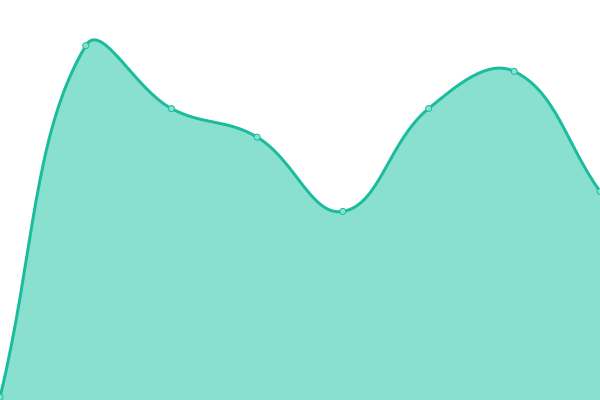

# [📈 Live Status](https://status2.zyki.net): <!--live status--> **🟧 Partial outage**

This repository contains the open-source uptime monitor and status page for [Sander Dijkxhoorn](http://zyki.nl/), powered by [Upptime](https://github.com/upptime/upptime).

With [Upptime](https://upptime.js.org), you can get your own unlimited and free uptime monitor and status page, powered entirely by a GitHub repository. We use [Issues](https://github.com/sanderDijkxhoorn/zyki.net-status/issues) as incident reports, [Actions](https://github.com/sanderDijkxhoorn/zyki.net-status/actions) as uptime monitors, and [Pages](https://status2.zyki.net) for the status page.

<!--start: status pages-->
<!-- This summary is generated by Upptime (https://github.com/upptime/upptime) -->
<!-- Do not edit this manually, your changes will be overwritten -->
<!-- prettier-ignore -->
| URL | Status | History | Response Time | Uptime |
| --- | ------ | ------- | ------------- | ------ |
|  [zyki.net](https://zyki.net) | 🟥 Down | [zyki-net.yml](https://github.com/sanderDijkxhoorn/zyki.net-status/commits/HEAD/history/zyki-net.yml) | 

 128ms
     
 | 

<a href="https://status2.zyki.net/history/zyki-net">9.26%</a>
    

|  [school.zyki.net](https://school.zyki.net) | 🟥 Down | [school-zyki-net.yml](https://github.com/sanderDijkxhoorn/zyki.net-status/commits/HEAD/history/school-zyki-net.yml) | 

 62ms
     
 | 

<a href="https://status2.zyki.net/history/school-zyki-net">5.03%</a>
    

|  [Hacker News](https://news.ycombinator.com) | 🟩 Up | [hacker-news.yml](https://github.com/sanderDijkxhoorn/zyki.net-status/commits/HEAD/history/hacker-news.yml) | 

 110ms
     
 | 

<a href="https://status2.zyki.net/history/hacker-news">100.00%</a>
    

<!--end: status pages-->

[**Visit our status website →**](https://status2.zyki.net)

## 📄 License

- Powered by: [Upptime](https://github.com/upptime/upptime)
- Code: [MIT](./LICENSE) © [Sander Dijkxhoorn](http://zyki.nl/)
- Data in the `./history` directory: [Open Database License](https://opendatacommons.org/licenses/odbl/1-0/)
