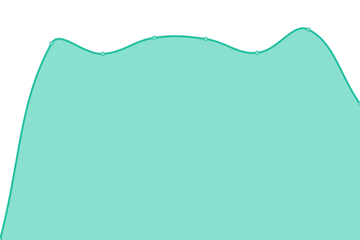

# [📈 Live Status](https://uptime.zyki.net): <!--live status--> **🟧 Partial outage**

This repository contains the open-source uptime monitor and status page for [Sander Dijkxhoorn](https://github.com/sanderDijkxhoorn), powered by [Upptime](https://github.com/upptime/upptime).

<!--start: status pages-->
<!-- This summary is generated by Upptime (https://github.com/upptime/upptime) -->
<!-- Do not edit this manually, your changes will be overwritten -->
<!-- prettier-ignore -->
| URL | Status | History | Response Time | Uptime |
| --- | ------ | ------- | ------------- | ------ |
|  [zyki.net](https://zyki.net/) | 🟥 Down | [zyki-net.yml](https://github.com/sanderDijkxhoorn/uptime/commits/HEAD/history/zyki-net.yml) | 

 115ms
     
 | 

<a href="https://uptime.zyki.net/history/zyki-net">0.00%</a>
    

|  [school.zyki.net](https://school.zyki.net/) | 🟥 Down | [school-zyki-net.yml](https://github.com/sanderDijkxhoorn/uptime/commits/HEAD/history/school-zyki-net.yml) | 

 98ms
     
 | 

<a href="https://uptime.zyki.net/history/school-zyki-net">0.00%</a>
    

|  [status.zyki.net](https://status.zyki.net/) | 🟥 Down | [status-zyki-net.yml](https://github.com/sanderDijkxhoorn/uptime/commits/HEAD/history/status-zyki-net.yml) | 

 0ms
     
 | 

<a href="https://uptime.zyki.net/history/status-zyki-net">0.00%</a>
    

|  [zyki.nl](http://zyki.nl/) | 🟩 Up | [zyki-nl.yml](https://github.com/sanderDijkxhoorn/uptime/commits/HEAD/history/zyki-nl.yml) | 

 937ms
     
 | 

<a href="https://uptime.zyki.net/history/zyki-nl">100.00%</a>
    

<!--end: status pages-->

[**Visit our status website →**](https://uptime.zyki.net)
